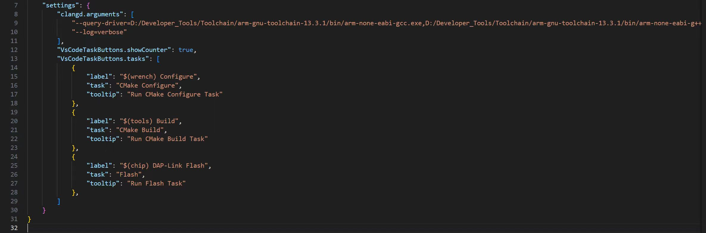
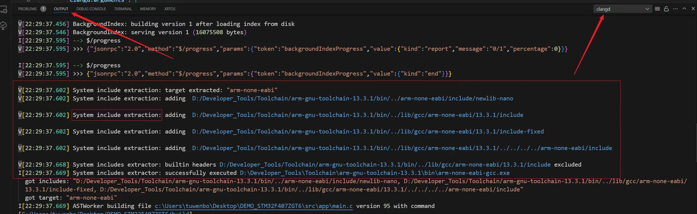

# FAQ

Date: 2024-11-21

Author: ControlCoreX

---


## Q1: clangd报错找不到标准库的头文件, stdio.h, stdint.h这些

这是因为没有像clangd指定我们所使用的编译器.

可以在`DEMO.code-workspace`文件中的settings里加上如下字段:

```json
"clangd.arguments": [
  "--query-driver=D:/Developer_Tools/Toolchain/arm-gnu-toolchain-13.3.1/bin/arm-none-eabi-gcc.exe"
],
```

即, 向clangd指定你所使用的编译器, 这样clangd就会根据编译器, 相对找到标准头文件所在的位置, 然后将那些目录给包含进来, 这样clangd就可以找到这些头文件了. (像上面这样指定C编译器就可以了, 下图中还指定了C++编译器, 如果没使用到C++则不用加)

> 注意: 上面的路径注意替换为自己电脑上的路径. 设置完毕之后, 删除.cache文件夹, 然后ctrl+shift+p, 选择"重启clangd语法服务器".

clangd里面其实专门有一个东西叫System Includes Extractor的东西, 专门用来根据指定的编译器路径相对找到头文件路径.





> `--log=verbose`参数可以让clangd打印出更详细的信息, 大家可以看看它输出的信息里面有关于System Includes Extractor的东西.

==强烈大家去clangd官网上看一下它的文档, 真的讲的非常详细==


## Q2: 会讲CMakeLists.txt怎么写吗

不会.

CMake东西太多了, 我不可能全部讲完, 而且里面很多东西我也不会.

所以最好是先去大致学一下CMake, 有一点基础, 然后再来看这个教程.


## Q3: 打开工程后状态栏没有显示"configure", "Build", "Flash"按钮

需要双击模板工程文件夹中的`xxx.code-workspace`文件打开工程, 而不能以`Open Folder`的方式打开.

还要确保安装了`Task Buttons`这个插件, 注意不要安装错了.


## Q4: clangd插件和C/C++插件只能安装一个

这两个插件是冲突的, 只能装一个, 如果想用巨硬官方的C/C++插件的话, 你就按照它的要求去配置. 这个插件我不太懂怎么配置.

要用clangd的话, 就什么配置文件也不用再添加, 模板工程里面有的就已经足够了.
当有问题的时候, 首先重启一下clangd语法服务器试试.


## Q5: 程序烧录失败

确保你所使用的芯片和烧录器与模板工程里面的`task.json`文件里面对`Flash`这个task的配置对应得上.

如果你使用的是CMSIS-DAP的话, 烧录器的配置文件不用改, 但如果你使用的是ST-Link的话, 就需要改把`cmsis-dap.cfg`改为`stlink-v2.cfg`.
